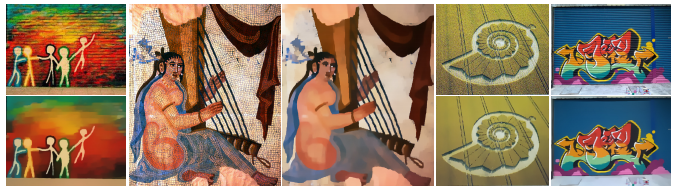

<!--
 * @lanhuage: python
 * @Descripttion: 
 * @version: beta
 * @Author: xiaoshuyui
 * @Date: 2020-04-30 10:21:20
 * @LastEditors: xiaoshuyui
 * @LastEditTime: 2020-04-30 10:49:37
 -->
# RTV in Python
 Relative Total Variation(a method for structure extraction from texture)

#### Related paper can be found in http://www.cse.cuhk.edu.hk/leojia/projects/texturesep/texturesep12.pdf

it is hard to say,but i think this method is not very impressive and efficient.

this is how RTV works in images with textures.

the corresponding MatLab codes and demo images can be found in folder "matlab code" 

use [rtv2.py](./rtv2.py) to test.

#### this is the result of max_iter=4 and img-size 64*64:

#### this is the result of max_iter=2 and img-size 64*64:

#### you can test MatLab codes on https://octave-online.net/ ,it is a convenient matlab online tool. :)

## quick use

> pip install -r requirements.txt
> python rtv2.py